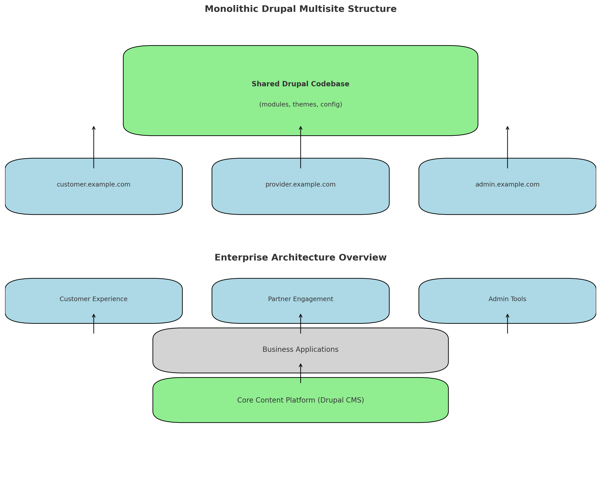

# HealthCare-CMS-Platform
How platform thinking, reusable content models, and Drupal as a CMS can streamline digital transformation across healthcare portals. Umbrella repo for architecture, docs, and governance.

Read more here https://technology-illumination.beehiiv.com/p/chief-architect-insights-why-healthcare-plan-providers-need-cms-centric-enterprise-architecture-with

